# Modern Persian University Website

A modern university website built with Next.js, TypeScript, and Tailwind CSS.

## Features

- Multi-page architecture
- Responsive design for desktop, tablet, and mobile devices
- Reusable component-based structure
- Modern UI and clean user experience
- SEO-friendly page metadata
- Organized project structure with separation of concerns

## Pages

- Home
- About
- Projects
- Courses
- Honors
- Blog
- Gallery
- Contact

## Tech Stack

- Next.js
- TypeScript
- Tailwind CSS
- Radix UI
- React Hook Form
- Recharts

## Project Structure

```text
src/
├── components/
├── features/
├── layouts/
├── styles/
├── types/
└── utils/

pages/
├── index.tsx
├── about.tsx
├── projects.tsx
├── courses.tsx
├── honors.tsx
├── blog.tsx
├── gallery.tsx
└── contact.tsx
```

## Getting Started

Install dependencies:

```bash
yarn install
```

Run the development server:

```bash
yarn dev
```

Open:

```text
http://localhost:3000
```

## Screenshots

### Home Page

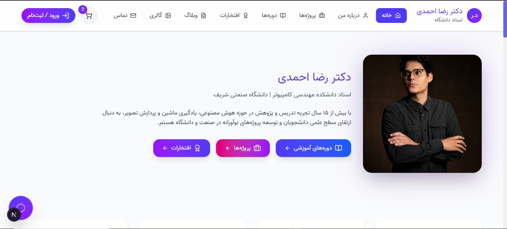

### Home Page Content

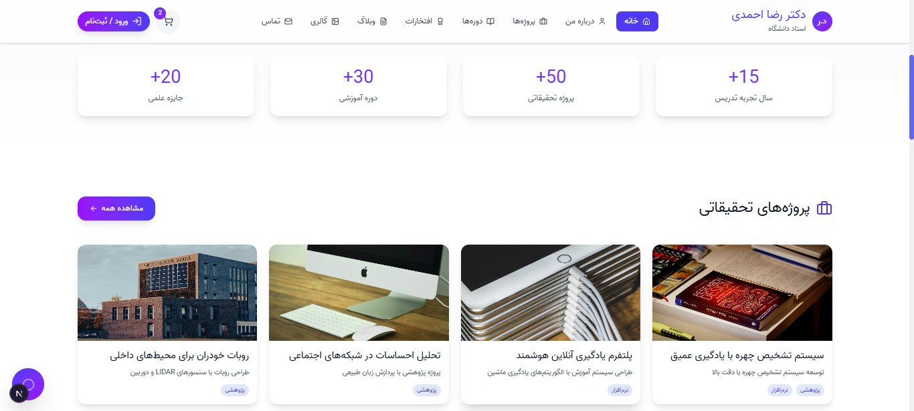

### Responsive

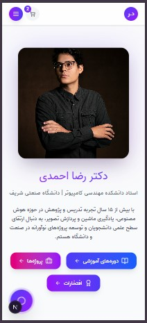

### About Page

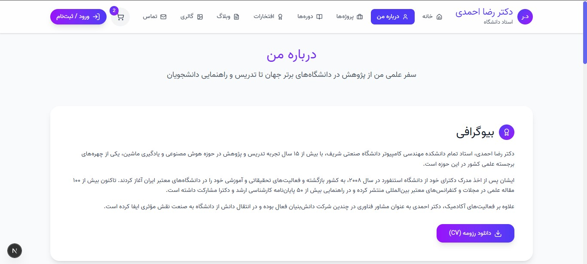

### About Page Content

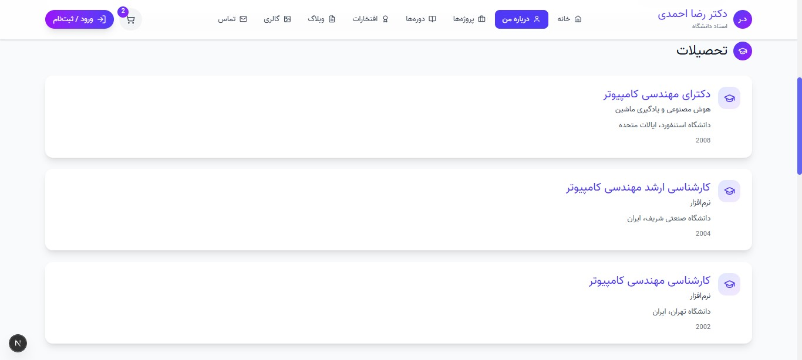

### Projects Page

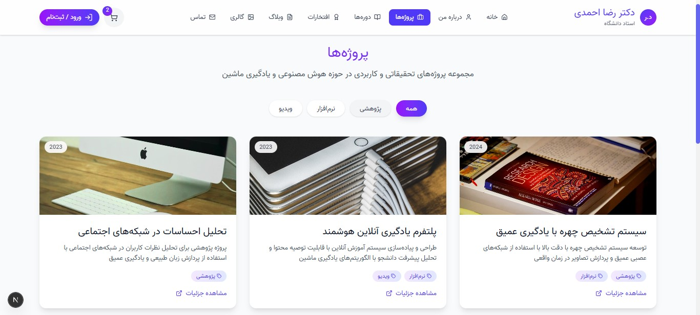

### Courses Page

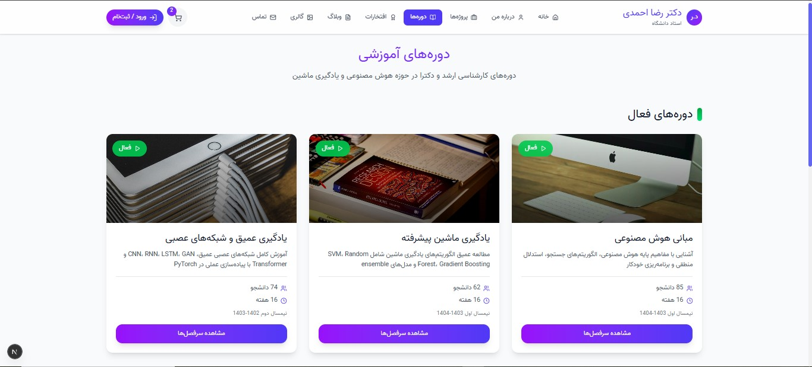

### Honors Page

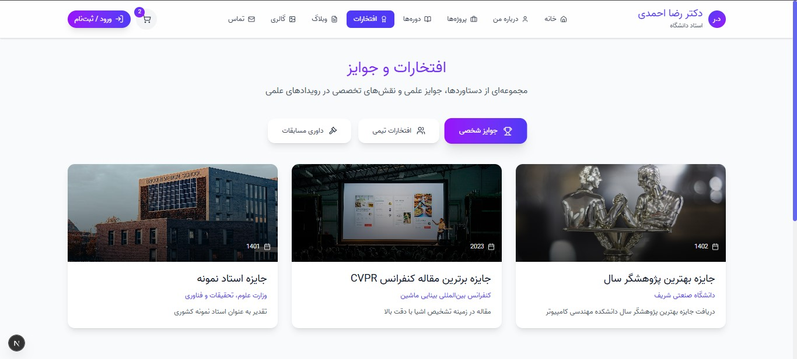

### Blog Page

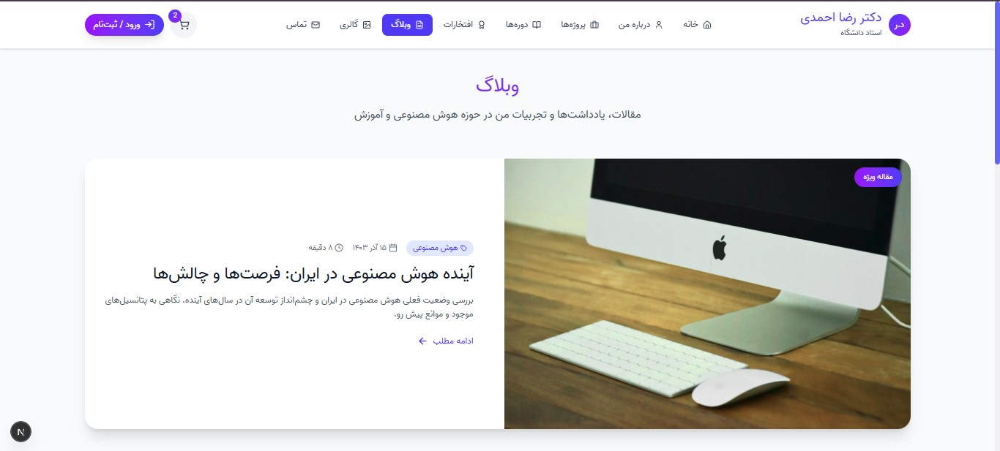

### Gallery Page

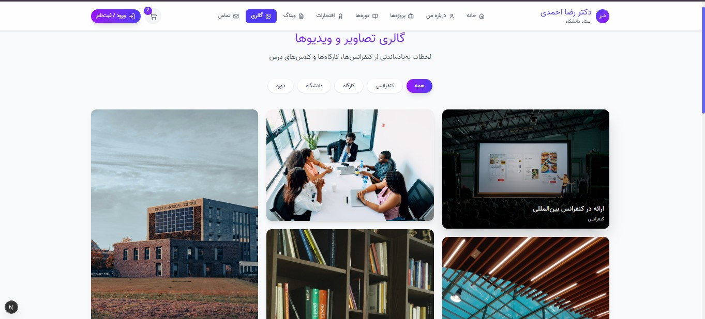

### Contact Page

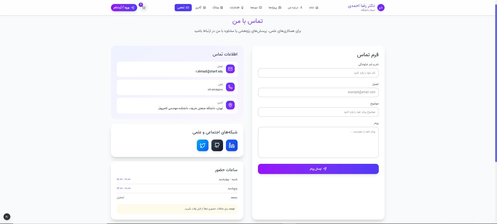

### Cart Component

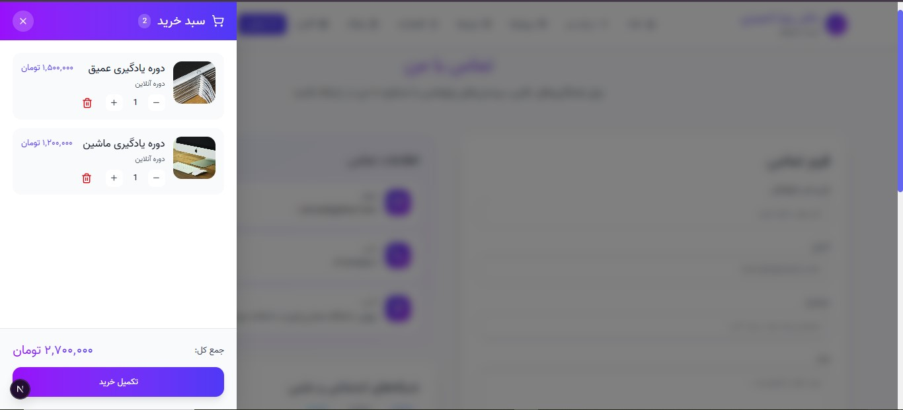

### Chat Box Component

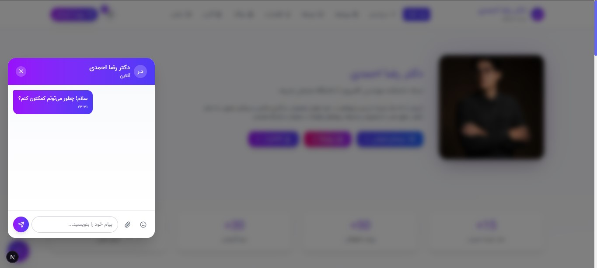

### Registry Page

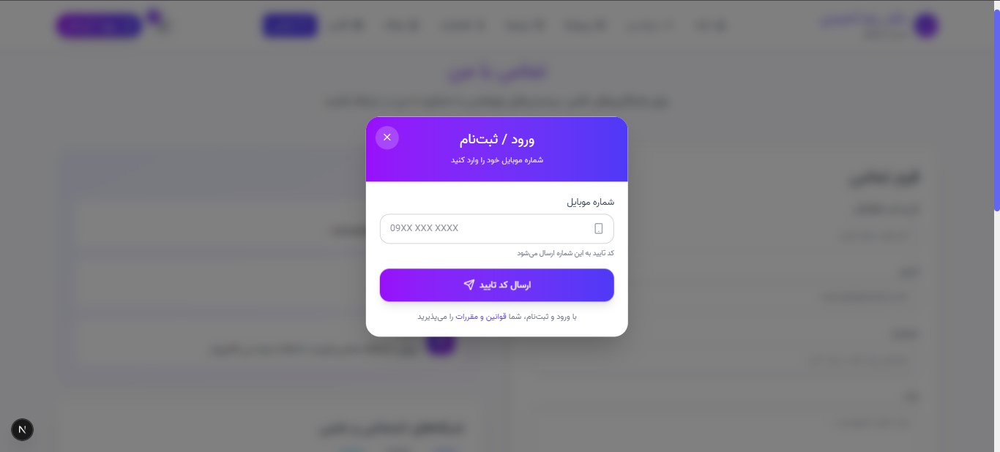

### Footer

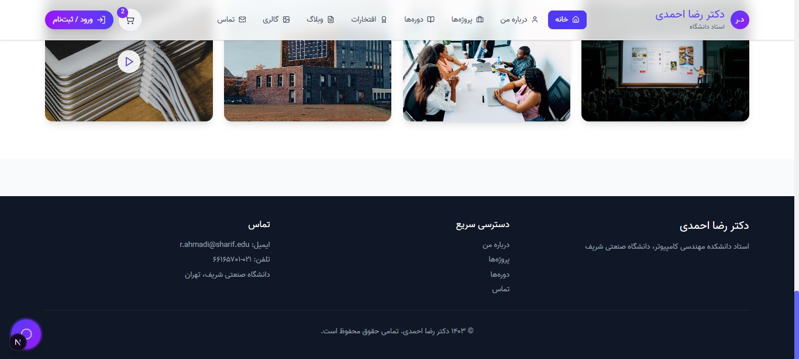

## License

This project is available for educational and portfolio purposes.
